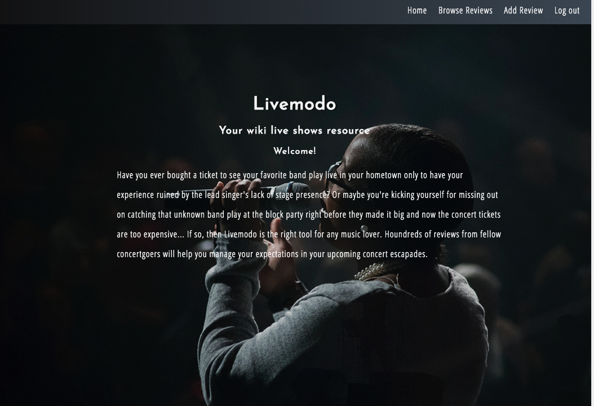
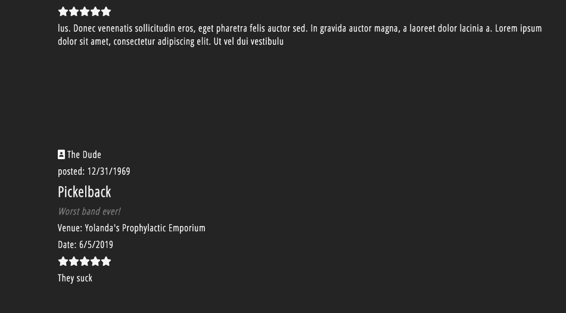
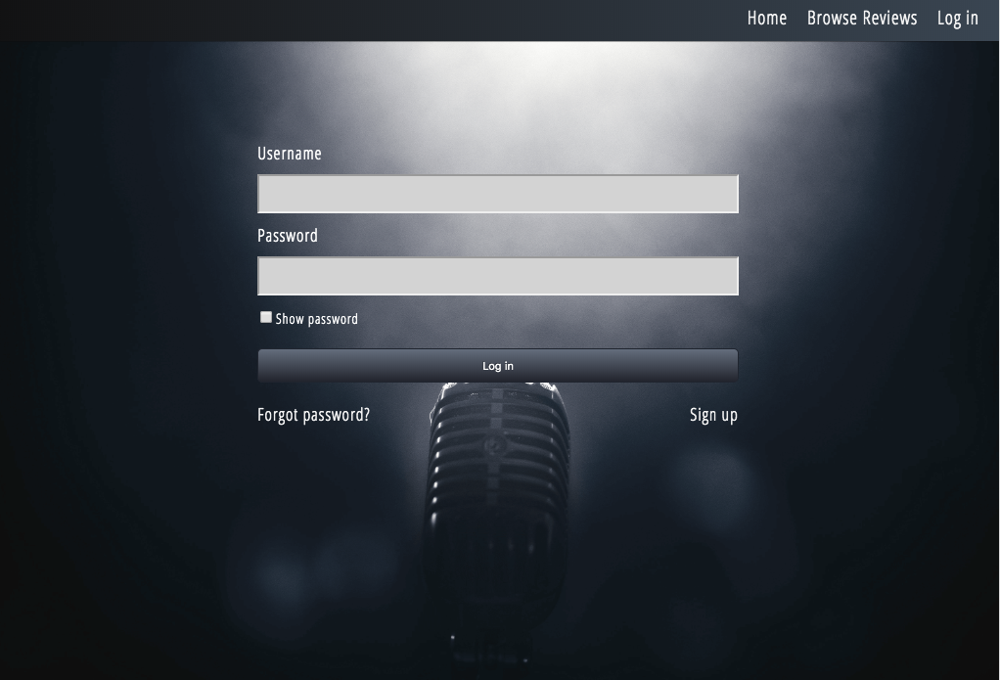
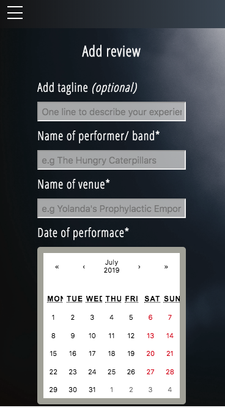

# Livemodo- a wiki live shows resource

## Table of Content
* [General Info](#general-info)
* [Technologies](#technologies)
* [Setup](#setup)
* [Features](#features)
* [Upcoming Features](#upcoming-features)
* [Screenshots](#screenshots)

### General Info
Livemodo is a wiki database of live shows and concert reviews. Think of it as a kind of Yelp for live music aficionados. With this app registered users are able to submit detailed reviews of live shows attended for fellow music lovers who are interested in discovering new music and live show venues. The backend was created with NodeJS, Express and the database was created with MongoDB

## [Live app](https://livemodo-benjcohen1985.vercel.app/)

### Technologies
Project is created with:
* React
* CSS3
* MongoDB
* NodeJS
* Express

### Features 
* Register as user
* Browse existing reviews (no registration needed)
* Submit reviews as registered user
* User authentication using remote database
* Responsive layout

### Upcoming features
* Geo location using Google Maps

#### Screenshots

